# System Architecture

This document provides a detailed overview of the system's architecture, data models, and runtime data flow. The diagrams herein are generated using a combination of manual and automated techniques to ensure they are both descriptive and maintainable.

---

## 1. High-Level Component Diagram

This diagram illustrates the major components of the project and their primary interactions. It provides a "bird's-eye view" of the repository's structure.

```mermaid
graph TD
    subgraph "Input & Output"
        A["📄 Raw TSV Data<br>(data/input/)"]
        Z["📊 Final CSV Report<br>(data/output/)"]
    end

    subgraph "Application Core (src/)"
        B["Orchestrator<br>(main.py, run_phase2.py)"]
        C["Shared Configuration<br>(config.py)"]
        D["Shared Data Models<br>(data/models.py)"]

        subgraph "Core Pipeline"
            direction LR
            P1["1. Parsers<br>(parsers/)"]
            P2["2. Extractors<br>(extractors/)"]
            P3["3. Analyzers<br>(analyzers/)"]
        end
    end

    subgraph "Development & Analysis Tooling"
        T1["Nox & Pre-commit<br>(noxfile.py, .pre-commit-config.yaml)"]
        T2["CI/CD Workflow<br>(.github/workflows/pylint.yml)"]
        T3["Analysis Scripts<br>(tools/)"]
    end

    %% Data Flow
    A -- "Reads raw text" --> P1
    P1 -- "Creates List&lt;Token&gt;" --> P2
    P2 -- "Creates List&lt;ClauseMateRelationship&gt;" --> P3
    P3 -- "Enriches relationships" --> B
    B -- "Writes to disk" --> Z

    %% Component Dependencies
    B -- "Uses" --> C
    B -- "Coordinates" --> P1
    B -- "Coordinates" --> P2
    B -- "Coordinates" --> P3
    P1 -- "Uses" --> D
    P2 -- "Uses" --> D
    P3 -- "Uses" --> D
    T3 -- "Analyzes" --> Z
```



---

## 2. Core Data Models (UML Class Diagram)

This diagram shows the primary data structures defined in `src/data/models.py` and their relationships. These models are the backbone of the application, ensuring type safety and clear data contracts between components.


---

## 3. Runtime Data Flow (Sequence Diagram)

This diagram illustrates the sequence of operations when the application is run. It shows how the main orchestrator coordinates the different pipeline components to process the input data and generate the final output.


---

## 4. Code-Level Flowchart (Generated)

This diagram provides a more granular, code-level view of the project's execution flow. It is automatically generated from the source code using the `code2flow` tool, showing the call relationships between functions and classes.


---

## 5. Diagram Generation and Rendering

This architecture document is a living document, designed to be updated as the codebase evolves. The diagrams are generated using specific tools that translate text-based definitions or source code into visuals. This approach, often called "Diagrams as Code," makes the documentation easy to version control and maintain.

A Python script, `tools/render_arch_doc.py`, automates the process of converting this Markdown file into a standalone HTML document with fully rendered diagrams.

### 5.1. Manually Created Diagrams (Mermaid.js)

The **High-Level Component Diagram**, **Core Data Models (UML)**, and **Runtime Data Flow (Sequence Diagram)** are created using [Mermaid.js](https://mermaid-js.github.io/mermaid/#/).

*   **What it is:** Mermaid is a JavaScript-based tool that renders diagrams and charts from text in a syntax similar to Markdown.
*   **How to reproduce/update:**
    1.  Edit the ` ```mermaid ... ``` ` code blocks directly in this Markdown file.
    2.  The syntax is well-documented on the Mermaid.js website.
    3.  Many Markdown editors (like the one on GitHub or in VS Code with the *Markdown Preview Mermaid Support* extension) provide live previews.
    4.  Run `python tools/render_arch_doc.py` to see the changes in the final HTML.

### 5.2. Auto-Generated Diagram (code2flow & Graphviz)

The **Code-Level Flowchart** is generated automatically by analyzing the Python source code.

*   **What it is:** The flowchart is a call graph that shows which functions and methods call each other. The graph's structure is defined using the **DOT language**, a plain text graph description language that is part of the [Graphviz](https://graphviz.org/) ecosystem.
*   **How to reproduce/update:**
    1.  The DOT graph definition inside the ` ```dot ... ``` ` block is generated by the [code2flow](https://github.com/scottrogowski/code2flow) Python package.
    2.  To regenerate the DOT code after significant changes to the `src` directory, you can run the following command:
        ```bash
        code2flow src/main.py src/parsers/tsv_parser.py src/extractors/relationship_extractor.py src/analyzers/base.py --output docs/project_flow.gv
        ```
    3.  Copy the contents of the generated `docs/project_flow.gv` file and paste it inside the ` ```dot ... ``` ` block in this file.
    4.  Run `python tools/render_arch_doc.py` to update the final HTML.

### 5.3. Final HTML Rendering Process

The `tools/render_arch_doc.py` script performs the following steps to create `docs/ARCHITECTURE.html`:

1.  **Reads `ARCHITECTURE.md`:** The script starts by reading the raw Markdown content of this file.

2.  **Renders the DOT Graph:**
    *   It finds the `dot` code block.
    *   To avoid requiring a local installation of Graphviz, the script sends the DOT code to the `https://quickchart.io/graphviz` web service.
    *   The service returns a Scalable Vector Graphic (SVG) of the flowchart, which is saved as `docs/project_flow.svg`.
    *   The script then replaces the ` ```dot ... ``` ` block in the Markdown with an `` tag pointing to the new SVG file.

3.  **Renders Mermaid Diagrams:**
    *   The script uses the `markdown` library with the `markdown-mermaid` extension. This wraps the Mermaid code blocks in the necessary HTML tags.

4.  **Assembles the Final HTML:**
    *   The script converts the modified Markdown to an HTML body.
    *   It then wraps this body in a complete HTML structure and injects the **Mermaid.js** library from a CDN, which allows the browser to render the Mermaid diagrams.

### 5.4. How to Regenerate the Full HTML Document

If you make any changes to this `ARCHITECTURE.md` file, run the following command from the project root to regenerate the final HTML document:

```bash
python tools/render_arch_doc.py
```

This will update `docs/ARCHITECTURE.html` with all the latest content and diagrams.
