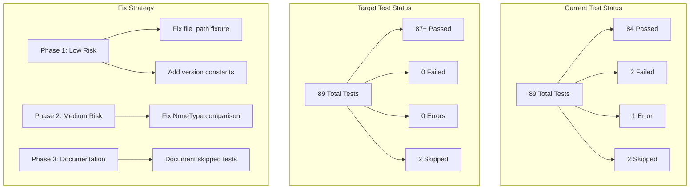
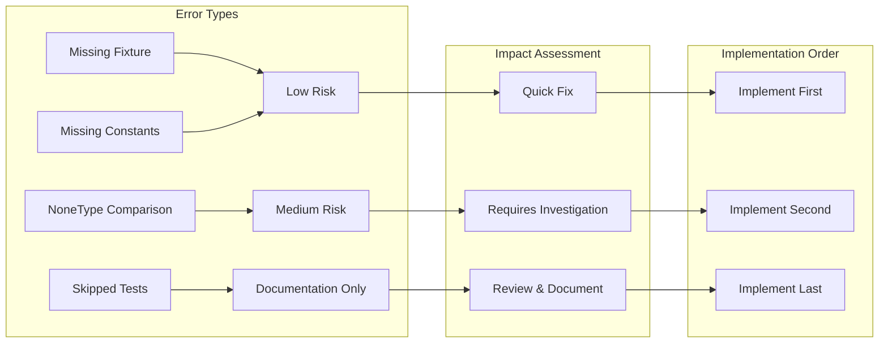
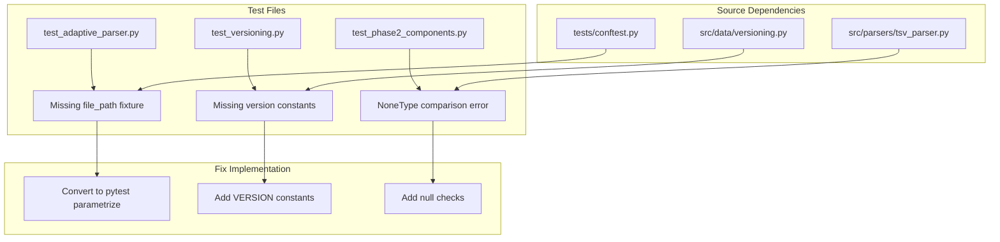
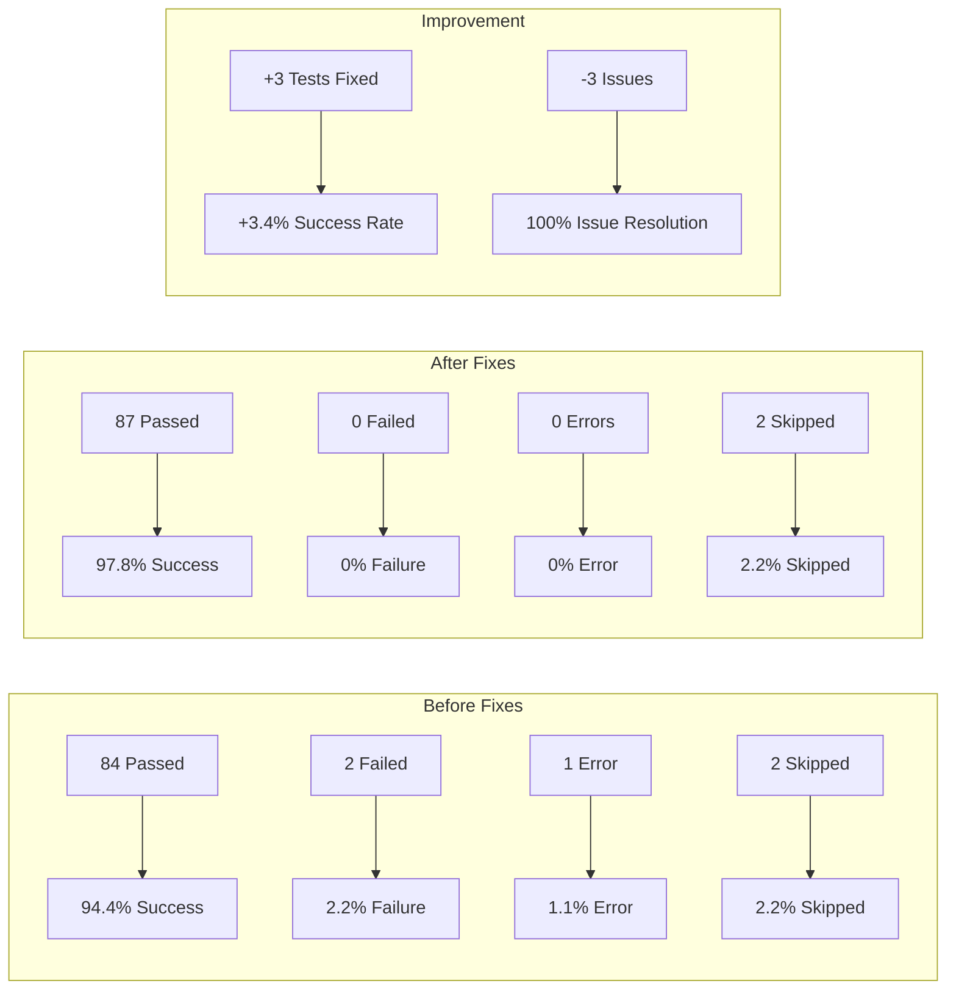
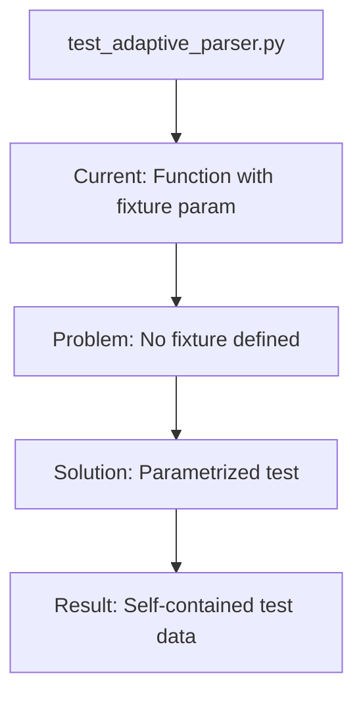
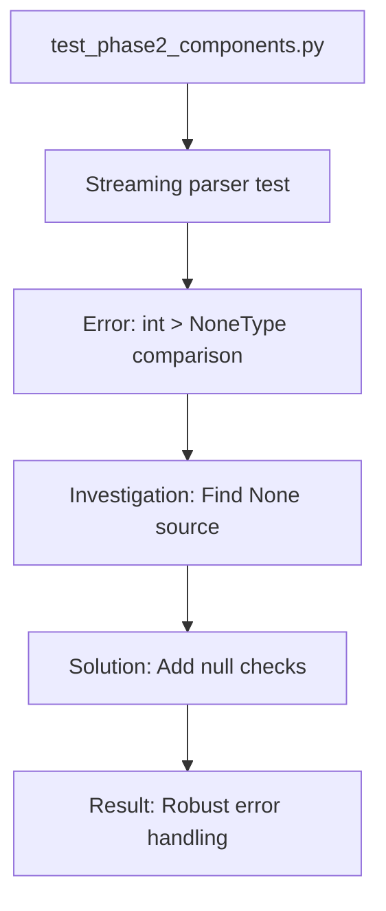
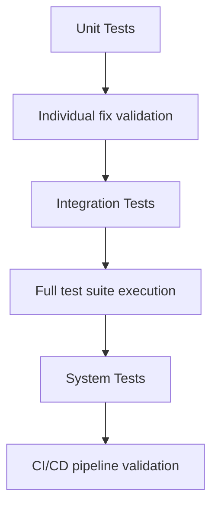
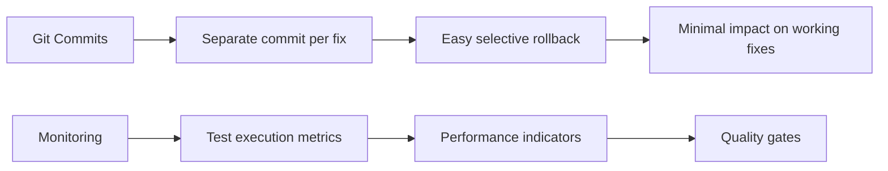

# Test Failure Fix Architecture

## System Overview



## Issue Classification Matrix



## Test Dependency Flow



## Risk Assessment Matrix

| Issue | Complexity | Impact | Risk Level | Est. Time |
|-------|------------|--------|------------|-----------|
| file_path fixture | Low | Low | 🟢 Low | 15 min |
| Version constants | Low | Low | 🟢 Low | 10 min |
| NoneType comparison | Medium | Medium | 🟡 Medium | 30 min |
| Skipped tests | Low | Low | 🟢 Low | 10 min |

## Implementation Workflow

```mermaid
sequenceDiagram
    participant Dev as Developer
    participant Test as Test Suite
    participant CI as CI/CD Pipeline

    Dev->>Test: Fix 1: file_path fixture
    Test-->>Dev: ✅ test_adaptive_parser.py passes

    Dev->>Test: Fix 2: Version constants
    Test-->>Dev: ✅ test_versioning.py passes

    Dev->>Test: Fix 3: NoneType comparison
    Test-->>Dev: ✅ test_phase2_components.py passes

    Dev->>Test: Run full test suite
    Test-->>Dev: ✅ 87/89 tests passing

    Dev->>CI: Commit all fixes
    CI-->>Dev: ✅ Pipeline success
```



## Success Metrics Dashboard



## Technical Architecture

### Fix 1: file_path Fixture Architecture



### Fix 2: Version Constants Architecture

```mermaid
graph TB
    A[test_versioning.py] --> B[Expects: VERSION constants]
    B --> C[Current: No constants in module]
    C --> D[Solution: Add VERSION, __version__, get_version()]
    D --> E[Result: Version management complete]
```

### Fix 3: NoneType Comparison Architecture



## Quality Assurance Strategy

### Testing Pyramid



### Validation Checkpoints

1. **Individual Test Validation**
   - Each fix tested in isolation
   - Verify no regressions introduced

2. **Integration Validation**
   - All fixes work together
   - No unexpected interactions

3. **Performance Validation**
   - Test execution time unchanged
   - Memory usage stable

4. **CI/CD Validation**
   - GitHub Actions pass
   - Reproducibility maintained

## Rollback Strategy



## Long-term Maintenance

### Continuous Improvement

- Establish test quality metrics
- Monitor test reliability trends
- Implement automated test health checks
- Regular review of skipped tests

### Documentation Standards

- Document all test fixes
- Maintain test architecture diagrams
- Update troubleshooting guides
- Create test best practices guide

---

**Architecture Version:** 1.0
**Created:** 2025-07-29
**Purpose:** Visual guide for systematic test failure resolution
